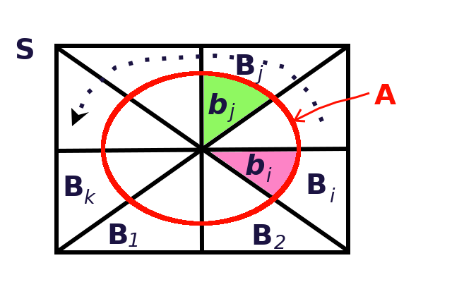
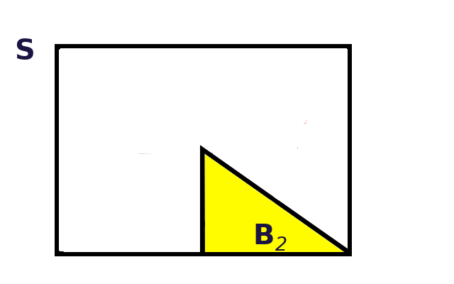
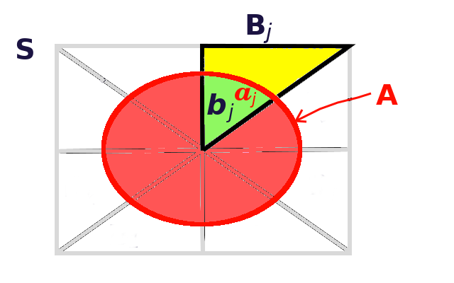
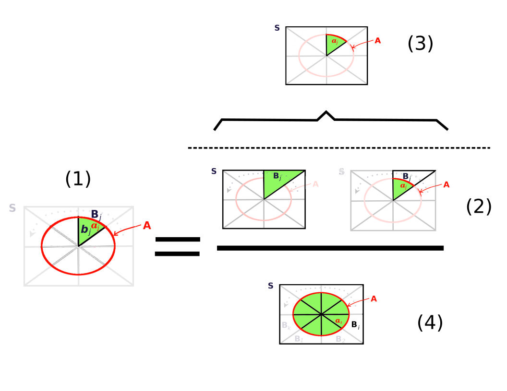

# Teorema de Bayes Explicado

Antes de proceder a la explicación del teorema, se enunciará éste de una manera plana.

## El teorema de Bayes

```{theorem bayes0, name="Teorema de Bayes"}
Dados los conjuntos (eventos)  $B_1, B_2, ... B_k$, disjuntos,  y los conjuntos $S$, que representa el universo, y $A$, tales que,

\begin{align*}
S &= \bigcup _{ i=1 }^{ k }{ { B }_{ i } } \\
A &\subseteq S
\end{align*}

se cumple que,

\begin{equation}
P\left( { B }_{ j }|A \right) =\frac { P\left( { B }_{ j } \right) \cdot P\left( A|{ B }_{ j } \right)  }{ \sum _{ i=1 }^{ k }{ P\left( { B }_{ i } \right) \cdot P\left( A|{ B }_{ i } \right)  }  }
(\#eq:TBayes)
\end{equation}

```

## Explicación gráfica del teorema

### Situación inicial

La Figura \@ref(fig:bayes-venn1) muestra, en un diagrama de Venn, más o menos la situación inicial planteada en el Teorema \@ref(thm:bayes0). Aquí se puede ver, por ejemplo, que todos los conjuntos disjuntos, $B_i$, representados por los triángulos de la figura, componen al conjunto $S$, representado por el rectángulo mayor de la figura, o que el conjunto $A$, representado por el óvalo rojo, está contenido en el conjunto $S$.

```{r bayes-venn1, echo=F, out.width='60.8%', fig.show='hold', fig.cap='Diagrama de Venn para el teorema de Bayes'}

```

Si se hiciera un símil entre las relaciones de áreas de la Figura \@ref(fig:bayes-venn1), con las probabilidades de los eventos, por ejemplo, la probabilidad del evento $B_2$, estaría dada por la relación de áreas que responde a la pregunta: *¿qué porción de $S$ ocupa $B_2$?*, y que se muestra en la siguiente fórmula y en la Figura \@ref(fig:areas1):

$$
P\left( { B }_{ 2 } \right) =\frac { area\left( { B }_{ 2 } \right)  }{ area\left( S \right)  } 
$$
Con el fin de simplificar, la fórmula anterior la denotaremos sólo con
\begin{equation}
P\left( { B }_{ 2 } \right) =\frac {  { B }_{ 2 }  }{  S  } 
(\#eq:rel-areas)
\end{equation}

```{r areas1, echo=F, out.width='60.8%', fig.show='hold', fig.cap='Relación de áreas: ¿qué porción de $S$ ocupa $B_2$?'}

```
Estrictamente hablando, el lado izquierdo de la igualdad en la Ecuación \@ref(eq:rel-areas), debería haberse escrito como $P\left( { B }_{ 2 }| S \right)$. Sin embargo, como $S$ representa el universo o espacio total de muestreo, se obvia en la fórmula, y se escribe simplemente como $P\left( { B }_{ 2 } \right)$.

En el mismo tenor, y tomando como referencia la Figura \@ref(fig:areas2), si $({ B }_{ j }\cap A) = { b }_{ j }= a_j$, hay dos preguntas interesantes aquí, a saber:

1. *¿Qué porción de $A$ ocupa $b_j$?*, o lo que es lo mismo, *¿Cuánto de $A$ está ocupando $B_j$?*, y en términos de probabilidad: 

\begin{equation}
P\left( { B }_{ j }| A \right) = { b }_{ j }/{ A }
(\#eq:B-rel-A)
\end{equation}

2. *¿Qué porción de $B_j$ ocupa $a_j$?*, o lo que es lo mismo, *¿Cuánto de $B_j$ está ocupando $A$?*, y en términos de probabilidad: 

\begin{equation}
P\left( { A } | { B }_{ j } \right) = { a }_{ j } /{ B }_{ j }
(\#eq:A-rel-B)
\end{equation}

```{r areas2, echo=F, out.width='60.8%', fig.show='hold', fig.cap='Relación de áreas: ¿qué porción de $A$ o de $B_j$ ocupa $b_j(=a_j)$?'}

```

### El teorema de la probabilidad total

De acuerdo con la Figura \@ref(fig:bayes-venn1), y como $A \subseteq S$, se cumple que:

\begin{equation}
A = A \cap S
(\#eq:A-in-S)
\end{equation}

Como $S = \bigcup _{ i=1 }^{ k }{ { B }_{ i } }$, se puede sustituir en la Ecuación \@ref(eq:A-in-S), con lo que se obtiene:

\begin{equation}
A=\left( A\cap { B }_{ 1 } \right) \cup \left( A\cap { B }_{ 2 } \right) \cup ...\left( A\cap { B }_{ k } \right)
(\#eq:A-in-Bi)
\end{equation}

Si se toma la probabilidad en ambos lados de la ecuación y como los $B_i$ son disjuntos, se obtiene:

\begin{equation}
\begin{split}
P\left( A \right) &=P\left( A\cap { B }_{ 1 } \right) + P\left( A\cap { B }_{ 2 } \right) + ...+ P\left( A\cap { B }_{ k } \right) \\
&= \sum _{ i=1 }^{ k }{ P\left( A\cap { B }_{ i } \right)  }
\end{split}
(\#eq:PA-in-Bi)
\end{equation}

El teorema del producto de probabilidades de eventos dependientes [@Walpole2012, pp. 66]
establece que

\begin{equation}
\begin{split}
P\left( X\cap Y \right) &=P\left( X \right) \cdot P\left( Y|X \right) \\
                        &=P\left( Y \right) \cdot P\left( X|Y \right)
\end{split}
(\#eq:Tprod)
\end{equation}

Si se aplica esto a la Ecuación \@ref(eq:PA-in-Bi), se tiene el   


```{theorem ptotal, name="Teorema de la probabilidad total"}
Dados los conjuntos (eventos)  $B_1, B_2, ... B_k$, disjuntos,  y los conjuntos $S$, que representa el universo, y $A$, tales que,

\begin{align*}
S &= \bigcup _{ i=1 }^{ k }{ { B }_{ i } } \\
A &\subseteq S
\end{align*}

se cumple que,

\begin{equation}
P\left( A \right) = \sum _{ i=1 }^{ k }{ P\left( { B }_{ i } \right) \cdot P\left( A|{ B }_{ i } \right) } 
(\#eq:TPtot)
\end{equation}

```

Gráficamente, si se toma como base la Ecuación \@ref(eq:A-rel-B), que representa la *relación de áreas* que se muestra en la Figura \@ref(fig:areas2), y se introduce en la Equación \@ref(eq:TPtot), se tendría que:

\begin{equation}
\begin{split}
P\left( A \right) &=\sum _{ i=1 }^{ k }{ \frac { B_{ i } }{ S } \frac { { a }_{ i } }{ { B }_{ i } }  }  \\
&=\frac { 1 }{ S } \sum _{ i=1 }^{ k }{  { a }_{ i } } = \frac { A }{ S } 
\end{split}
(\#eq:TAtot)
\end{equation}

### El teorema de Bayes: deducción y explicación analítica

Para deducir el teorema de Bayes, enunciado en el Teorema \@ref(thm:bayes0) al principio de este capítulo, se parte del teorema del producto de probabilidades de eventos dependientes, dado en la Ecuación \@ref(eq:Tprod). En este caso, se aplica a los eventos $A$ y uno, cualquiera, de los $B_j$, así:

\begin{equation}
 P\left( A \right) \cdot P\left( { B }_{ j } | A \right) = P\left( A\cap { B }_{ j } \right) = 
 P\left( { B }_{ j } \right) \cdot P\left( A | { B }_{ j } \right)
(\#eq:ABj)
\end{equation}

Si se despeja, se obtiene:

\begin{equation}
 P\left( { B }_{ j } | A \right) = 
 \frac { P\left( { B }_{ j } \right) \cdot P\left( A | { B }_{ j } \right) }{ P\left( A \right) }
(\#eq:ABj-frac)
\end{equation}

Finalmente se sustituye $P(A)$, haciendo uso del Teorema de la probabilidad total (\@ref(thm:ptotal)), dado en la Ecuación \@ref(eq:TPtot), y se llega al teorema de Bayes:

\begin{equation}
 P\left( { B }_{ j } | A \right) = 
 \frac { P\left( { B }_{ j } \right) \cdot P\left( A | { B }_{ j } \right) }{ \sum _{ i=1 }^{ k }{ P\left( { B }_{ i } \right) \cdot P\left( A|{ B }_{ i } \right) } }
(\#eq:TBayes0)
\end{equation}

Para explicar el significado del teorema, se recurrirá a la Figura \@ref(fig:Bayes0). La parte (1) de la figura representa el lado izquierdo de la igualdad en la Ecuación \@ref(eq:TBayes0), las partes (2) y (3), representan el numerador del cociente en el lado derecho de igualdad en la ecuación, y la parte (4) representa el denominador.

```{r Bayes0, echo=F, out.width='90.8%', fig.show='hold', fig.cap='Explicación gráfica del teorema de Bayes'}

```

A continuación se explica cada una de las partes de la Figura \@ref(fig:Bayes0).

#### Parte (1): Lado izquierdo y *objetivo* del teorema {#objetivo}

El lado izquierdo de la igualdad en la Ecuación \@ref(eq:TBayes0), establece el *objetivo*, por así decirlo, del teorema; esto es, lo que se quiere obtener. En este caso es, $P\left( { B }_{ j } | A \right)$, lo que gráficamente, como se muestra en la parte (1) de Figura \@ref(fig:Bayes0), es la porción que $B_j$ ocupa del área $A$. En términos estadísticos, es la probabilidad de que ocurra $B_j$ dado que ocurrió $A$. Gráficamente, y en términos de relaciones de áreas esto es:

\begin{equation}
P\left( { B }_{ j } | A \right) = \frac { { b }_{ j } }{ A }
(\#eq:objetivo)
\end{equation}


#### Partes (2) y (4): Lado derecho, el *método* del teorema {#metodo}

El lado derecho de la igualdad en la Ecuación \@ref(eq:TBayes0), establece el *método*, esto es, la forma o manera de obtener lo que se ha establecido en el *objetivo*. En este caso, se trata de un cociente compuesto de dos partes, el numerador y el denominador. 

Es importante notar que, en la fórmula del teorema, dada en la Ecuación \@ref(eq:TBayes0), la estructura del numerador y el denominador es semejante: incluye un producto del tipo $P\left( { B }_{ r } \right) \cdot P\left( A | { B }_{ r } \right)$, donde, ya sea, $r=j$, o $r=i$, salvo que en el caso del numerador sólo se trata de uno de estos productos, mientras que en el caso del denominador se trata de una suma de los productos, de tal manera que, lo que se diga acerca del producto registrado en el numerador, aplica a cada uno de los productos de la suma registrada en el denominador.

#### Parte (2): El numerador {#numerador}

El numerador es un producto compuesto de dos factores: $P\left( { B }_{ j } \right)$  y $P\left( A | { B }_{ j } \right)$, que corresponden respectivamente a cada una de las dos gráficas en la parte (2) de la Figura \@ref(fig:Bayes0). El primer factor, y la correspondiente primera gráfica, representan la porción que ocupa $B_j$ del *universo*, $S$, esto es, la relación de áreas,

\begin{equation}
P\left( { B }_{ j } \right) = \frac { { B }_{ j } }{ S }
(\#eq:Bj-en-S)
\end{equation}

El segundo factor, y la correspondiente segunda gráfica, representan la porción que ocupa $A$ de $B_j$, esto es, la relación de áreas,

\begin{equation}
P\left( A | { B }_{ j } \right) = \frac { { a }_{ j } }{ { B }_{ j } }
(\#eq:A-en-Bj)
\end{equation}

#### Parte (3): El numerador {#aj-En-S}

Si se procede a desarrollar el producto de los lados derechos de la Ecuaciones \@ref(eq:Bj-en-S) y \@ref(eq:A-en-Bj), se obtiene:

\begin{equation}
\frac { { B }_{ j } }{ S } \cdot \frac { { a }_{ j } }{ { B }_{ j } } =  \frac { { a }_{ j } }{ S }
(\#eq:aj-en-S)
\end{equation}

Que es la porción que ocupa $a_j$, resultado de la intersección entre $A$ y $B_j$, del *universo*, $S$, y que es precisamente lo que registra la gráfica de la parte (3) de la Figura \@ref(fig:Bayes0).

#### Parte (4): El denominador {#denominador}

Como se ha mencionado en la Sección \@ref(metodo), el denominador es la sumatoria de productos del tipo $P\left( { B }_{ r } \right) \cdot P\left( A | { B }_{ r } \right)$, y, por consiguiente, para cada uno de éstos aplica lo desarrollado en las dos secciones anteriores (\@ref(numerador) y \@ref(aj-En-S)). Esto es, para cada elemento del tipo $B_i$, se tendría un resultado similar al expresado por la gráfica de la parte (3) de la Figura \@ref(fig:Bayes0). Al sumar todos esos resultados, se obtiene justamente lo expresado por la gŕafica de la parte (4) de la Figura \@ref(fig:Bayes0), que representa la reconstrucción del área $A$ en relación con el área que representa el *universo*, $S$. Vale decir que esta reconstrucción es propiamente lo que establece el Teorema \@ref(thm:ptotal) de la probabilidad total. Esta sumatoria resulta entonces en

\begin{equation}
\begin{split}
\sum _{ i=1 }^{ k }{ P\left( { B }_{ i } \right) \cdot P\left( A|{ B }_{ i } \right) } &=  \frac { { A } }{ S } \\
&= P\left(A | S \right) =  P\left(A \right)
\end{split}
(\#eq:TAtotV2)
\end{equation}

#### El cociente

Al dividir el numerador establecido en la Ecuación \@ref(eq:aj-en-S), entre el denominador, tal como se establece en la Ecuación \@ref(eq:TAtotV2), se llega al siguiente resultado:

\begin{equation}
\frac { \frac { { a }_{ j } }{ S } }{ \frac { A }{ S } } = \frac { { a }_{ j } }{ A }
(\#eq:cociente)
\end{equation}

Este resultado coincide con el *objetivo* establecido en la Sección \@ref(objetivo), en la Ecuación \@ref(eq:objetivo) y con la parte (1) de la Figura \@ref(fig:Bayes0), ya que $a_j = b_j$.

#### Colofón

En la Sección \@ref(objetivo) se estableció el *objetivo* del teorema, que es obtener $P\left( { B }_{ j } | A  \right)$ y, a partir de ahí, en las siguientes secciones se analizó el método para llegar a ese objetivo que es a través del cálculo de un conjunto de productos del tipo $P\left( { B }_{ i } \right) \cdot P\left( A | { B }_{ i } \right)$. Cabe notar que, uno de estos productos es precisamente el que figura en el numerador del teorema, a saber, $P\left( { B }_{ j } \right) \cdot P\left( A | { B }_{ j } \right)$, que corresponde al evento $B_j$ del *objetivo* del teorema. El denominador, por su parte, es la suma de todos los productos calculados.


