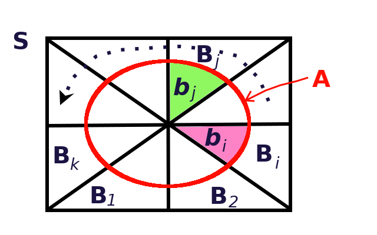
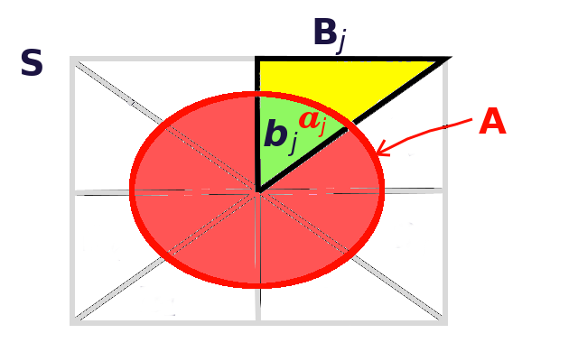

# Teorema de Bayes Explicado

Antes de proceder a la explicación del teorema, se enunciará éste de una manera plana.

## El teorema de Bayes

```{theorem bayes0}
Dados los conjuntos (eventos)  $B_1, B_2, ... B_k$, disjuntos,  y los conjuntos $S$, que representa el universo, y $A$, tales que,

\begin{align*}
S &= \bigcup _{ i=1 }^{ k }{ { B }_{ i } } \\
A &\subseteq S
\end{align*}

se cumple que,

\begin{equation}
P\left( { B }_{ j }|A \right) =\frac { P\left( { B }_{ j } \right) \cdot P\left( A|{ B }_{ j } \right)  }{ \sum _{ i=1 }^{ k }{ P\left( { B }_{ i } \right) \cdot P\left( A|{ B }_{ i } \right)  }  }
(\#eq:TBayes)
\end{equation}

```

## Explicación gráfica del teorema

### Situación inicial

La Figura \@ref(fig:bayes-venn1) muestra, en un diagrama de Venn, más o menos la situación inicial planteada en el Teorema \@ref(thm:bayes0). Aquí se puede ver, por ejemplo, que todos los conjuntos disjuntos, $B_i$, representados por los triángulos de la figura, componen al conjunto $S$, representado por el rectángulo mayor de la figura, o que el conjunto $A$, representado por el óvalo rojo, está contenido en el conjunto $S$.

```{r bayes-venn1, echo=F, out.width='60.8%', fig.show='hold', fig.cap='Diagrama de Venn para el teorema de Bayes'}

```

Si se hiciera un símil entre las relaciones de áreas de la Figura \@ref(fig:bayes-venn1), con las probabilidades de los eventos, por ejemplo, la probabilidad del evento $B_2$, estaría dada por la relación de áreas que responde a la pregunta: *¿qué porción de $S$ ocupa $B_2$?*, y que se muestra en la siguiente fórmula y en la Figura \@ref(fig:areas1):

$$
P\left( { B }_{ 2 } \right) =\frac { area\left( { B }_{ 2 } \right)  }{ area\left( S \right)  } 
$$
Con el fin de simpliicar, la fórmula anterior la denotaremos sólo con
\begin{equation}
P\left( { B }_{ 2 } \right) =\frac {  { B }_{ 2 }  }{  S  } 
(\#eq:rel-areas)
\end{equation}

```{r areas1, echo=F, out.width='60.8%', fig.show='hold', fig.cap='Relación de áreas: ¿qué porción de $S$ ocupa $B_2$?'}
knitr::include_graphics('images/Bayes3.png')
```
Estrictamente hablando, el lado izquierdo de la igualdad en la Ecuación \@ref(eq:rel-areas), debería haberse escrito como $P\left( { B }_{ 2 }| S \right)$. Sin embargo, como $S$ representa el universo o espacio total de muestreo, se obvia en la fórmula, y se escribe simplemente como $P\left( { B }_{ 2 } \right)$.

En el mismo tenor, y tomando como referencia la Figura \@ref(fig:areas2), si $({ B }_{ j }\cap A) = { b }_{ j }= a_j$, hay dos preguntas interesantes aquí, a saber:

1. *¿Qué porción de $A$ ocupa $b_j$?*, o lo que es lo mismo, *¿Cuánto de $A$ está ocupando $B_j$?*, y en términos de probabilidad: 
\begin{equation}
P\left( { B }_{ j }| A \right) = { b }_{ j }/{ A }
(\#eq:B-rel-A)
\end{equation}

1. *¿Qué porción de $B_j$ ocupa $a_j$?*, o lo que es lo mismo, *¿Cuánto de $B_j$ está ocupando $A$?*, y en términos de probabilidad: 
\begin{equation}
P\left( { A } | { B }_{ j } \right) = { a }_{ j } /{ B }_{ j } 
(\#eq:A-rel-B)
\end{equation}

```{r areas2, echo=F, out.width='60.8%', fig.show='hold', fig.cap='Relación de áreas: ¿qué porción de $A$ o de $B_j$ ocupa $b_j(=a_j)$?'}

```

### El teorema de la probabilidad total

De acuerdo con la Figura \@ref(fig:bayes-venn1), y como $A \subseteq S$, se cumple que:
\begin{equation}
A = A \cap S 
(\#eq:A-in-S)
\end{equation}

Como $S = \bigcup _{ i=1 }^{ k }{ { B }_{ i } }$, se puede sustituir en la Ecuación \@ref(eq:A-in-S), con lo que se obtiene:
\begin{equation}
A=\left( A\cap { B }_{ 1 } \right) \cup \left( A\cap { B }_{ 2 } \right) \cup ...\left( A\cap { B }_{ k } \right) 
(\#eq:A-in-Bi)
\end{equation}
Si se toma la probabilidad en ambos lados de la ecuación y como los $B_i$ son disjuntos, se obtiene:
\begin{equation}
\begin{split}
P\left( A \right) &=P\left( A\cap { B }_{ 1 } \right) + P\left( A\cap { B }_{ 2 } \right) + ...+ P\left( A\cap { B }_{ k } \right) \\
&= \sum _{ i=1 }^{ k }{ P\left( A\cap { B }_{ i } \right)  }
\end{split} 
(\#eq:PA-in-Bi)
\end{equation}
El teorema del producto de probabilidades de eventos dependientes 
establece que 
\begin{equation}
\begin{split}
P\left( X\cap Y \right) &=P\left( X \right) \cdot P\left( Y|X \right) \\
                        &=P\left( Y \right) \cdot P\left( X|Y \right)
\end{split} 
(\#eq:Tprod)
\end{equation}
Si se aplica esto a la Ecuación \@ref(eq:PA-in-Bi), se tiene el  

```{theorem ptotal}
Dados los conjuntos (eventos)  $B_1, B_2, ... B_k$, disjuntos,  y los conjuntos $S$, que representa el universo, y $A$, tales que,

\begin{align*}
S &= \bigcup _{ i=1 }^{ k }{ { B }_{ i } } \\
A &\subseteq S
\end{align*}

se cumple que,

\begin{equation}
P\left( A \right) = \sum _{ i=1 }^{ k }{ P\left( { B }_{ i } \right) \cdot P\left( A|{ B }_{ i } \right) } 
(\#eq:TPtot)
\end{equation}

```

Gráficamente, si se toma como base la Ecuación \@ref(eq:A-rel-B), que representa la *relación de áreas* que se muestra en la Figura \@ref(fig:areas2), y se introduce en la Equación \@ref(eq:TPtot), se tendría que:

\begin{equation}
\begin{split}
P\left( A \right) &=\sum _{ i=1 }^{ k }{ \frac { B_{ i } }{ S } \frac { { a }_{ i } }{ { B }_{ i } }  }  \\
&=\frac { 1 }{ S } \sum _{ i=1 }^{ k }{  { a }_{ i } } = \frac { A }{ S } 
\end{split}
(\#eq:TAtot)
\end{equation}

### El teorema de Bayes: deducción y explicación

Para deducir el teorema de Bayes, enunciado en el Teorema \@ref(thm:bayes0) al principio de este capítulo, se parte del teorema del producto de probabilidades de eventos dependientes, dado en la Ecuación \@ref(eq:Tprod). En este caso, se aplica a los eventos $A$ y uno, cualquiera, de los $B_j$, así:
\begin{equation}
 P\left( A \right) \cdot P\left( { B }_{ j } | A \right) = P\left( A\cap { B }_{ j } \right) = 
 P\left( { B }_{ j } \right) \cdot P\left( A | { B }_{ j } \right)
(\#eq:ABj)
\end{equation}
Si se despeja, se obtiene:
\begin{equation}
 P\left( { B }_{ j } | A \right) = 
 \frac { P\left( { B }_{ j } \right) \cdot P\left( A | { B }_{ j } \right) }{ P\left( A \right) } 
(\#eq:ABj-frac)
\end{equation}
Finalmente se sustituye $P(A)$, haciendo uso del Teorema de la probabilidad total (\@ref(thm:ptotal)), dado en la Ecuación \@ref(eq:TPtot), y se llega al teorema de Bayes:
\begin{equation}
 P\left( { B }_{ j } | A \right) = 
 \frac { P\left( { B }_{ j } \right) \cdot P\left( A | { B }_{ j } \right) }{ \sum _{ i=1 }^{ k }{ P\left( { B }_{ i } \right) \cdot P\left( A|{ B }_{ i } \right) } } 
(\#eq:TBayes0)
\end{equation}

Para explicar el significado del teorema, se recurrirá a la Figura \@ref(fig:Bayes0). La sección (1) de la figura representa el lado izquierdo de la igualdad en la Ecuación \@ref(eq:TBayes0), las secciones (2) y (3), representan el numerador del cociente en el lado derecho de igualdad en la ecuación, y la sección (4) representa el denominador.

```{r Bayes0, echo=F, out.width='90.8%', fig.show='hold', fig.cap='Explicación gráfica del teorema de Bayes'}
knitr::include_graphics('images/Bayes0.png')
```

#### Sección (1): Lado izquierdo y *objetivo* del teorema

El lado izquierdo de la igualdad en la Ecuación \@ref(eq:TBayes0), establece el *objetivo*, por así decirlo, del teorema; esto es, lo que se quiere encontrar. En este caso es, $P\left( { B }_{ j } | A \right)$, lo que gráficamente, como se muestra en la sección (1) de Figura \@ref(fig:Bayes0), es la porción que $B_j$ ocupa del área $A$. En términos estadísticos, es la probabilidad de que ocurra $B_j$ dado que ocurrió $A$. 

#### Sección (2): El numerador

aquí aquí aquí
