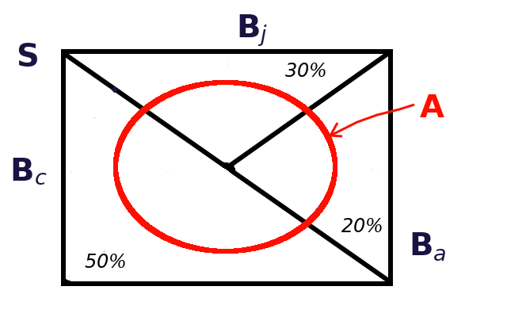

# Ejemplos

## Ejemplo 1

Por razones de pagos en publicidad, un piloto de autos usa un Corvette en el 50% de las carreras en las que participa, un Jaguar, en el 30% de esas carreras y un Alfa Romeo, en el 20% de las mismas. De 25 carreras en las que ha participado con el Corvette, ha ganado 5; de 15, en las que ha participado con el Jaguar, ha ganado 4; y de 10, en las que ha participado con el Alfa Romeo, ha ganado 4.

a. Haciendo uso de esa información para estimar las probabilidades, indique cuál es la probabilidad de que el piloto gane la reciente carrera en la que participará en Le Mans.
a. Suponiendo que llega la notificación de que, en efecto, ganó la carrera, ¿cuál es la probabilidad de que haya manejado el Corvette?

NOTA: Este ejemplo fue tomado de los ejercicios del libro de @Miller65 pp. 32-34.

### Solución {-}

La Figura \@ref(fig:Autos1) representa esquemáticamente algunos de los elementos del problema, en esta figura:

1. $S$ representa el conjunto de todas las carreras que ha corrido el piloto.
1. $B_c$ son las carreras en las que ha usado el Corvette.
1. $B_j$ son las carreras en las que ha usado el Jaguar.
1. $B_a$ son las carreras en las que ha usado el Alfa Romeo.
1. $A$ representa el conjunto de carreras en las que ha ganado.

```{r Autos1, echo=F, out.width='60.8%', fig.show='hold', fig.cap='Diagrama de Venn para el problema del piloto de autos'}

```

Para resolver el problema se usará el lenguaje de programación R [@Santana14]. El primer paso es la construcción de una tabla con la información

```{r}
datos <- data.frame(
      #             Corvette    Jaguar    Alfa_Romeo
      P.B     =  c(    0.5   ,    0.3   ,    0.2       ),  # P(B)
      P.A_B   =  c(   5/25   ,   4/15   ,   4/10       ),  # P(A|B)
  row.names   =  c("Corvette", "Jaguar" , "Alfa_Romeo" )
)
print(datos)
```

Esta misma información se puede ver en la Tabla \@ref(tab:tabla-info), donde la columna **P.B** representa la probabilidad del conjunto $B$ en el renglón correspondiente, y la columna **P.A_B** es la probabilidad de que se ganó la carrera dado que se usó el auto en el renglón correspondiente.

```{r tabla-info, echo=FALSE}
knitr::kable(datos, caption = "Información del piloto de autos",
             booktabs = T)
```

La solución del inciso **a** del problema se obtiene por medio de la aplicación del Teorema \@ref(thm:ptotal) de la probabilidad total. Esto es multiplicar las columnas "P.B" y "P.A_B" de la tabla anterior y sumar todos los resultados.

```{r}
datos$Prod <- datos$P.B * datos$P.A_B
```

El resultado de este producto se puede ver en la columna **Prod** de la Tabla \@ref(tab:tabla-c-prod)

```{r tabla-c-prod, echo=FALSE}
knitr::kable(datos, caption = "Productos de probabilidades",
             booktabs = T)
```

Ahora se procede a hacer la suma de los valores en la columna **Prod** de la Tabla \@ref(tab:tabla-c-prod) con

```{r}
(Prob.A <- sum(datos$Prod))
```

Asi entonces, la **probabilidad de que el piloto gane su carrera** es del `r Prob.A*100`%.

Para resolver el inciso **b** del problema se aplica el Teorema \@ref(thm:bayes0) de Bayes. En este caso es simplemente dividir el producto en el renglón correspondiente al auto "Corvette" entre la probabilidad recien obtenida, así:

```{r}
(Prob.Corvette <- datos["Corvette","Prod"]/Prob.A)
```
Esto es, dado que el piloto en efecto ganó la carrera, la **probabilidad de que haya usado el Corvette** es de `r Prob.Corvette*100`%.
