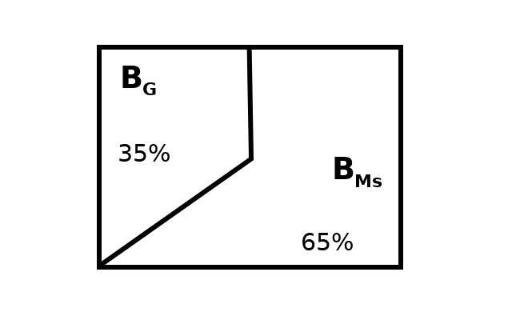
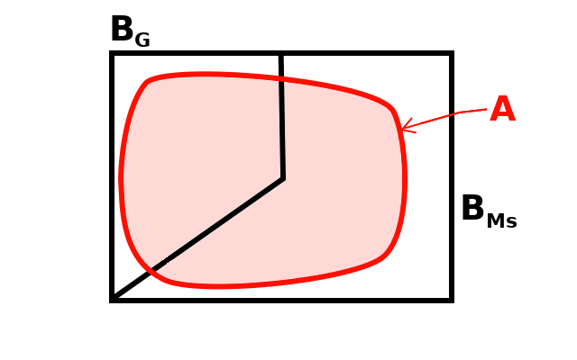
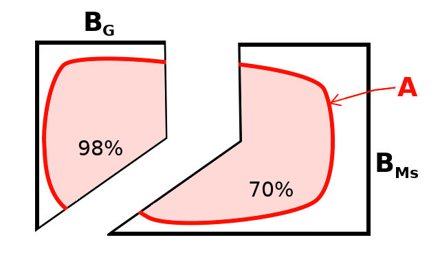

# Ejemplos

## Ejemplo 1

Por razones de pagos en publicidad, un piloto de autos usa un Corvette en el 50% de las carreras en las que participa, un Jaguar, en el 30% de esas carreras y un Alfa Romeo, en el 20% de las mismas. De 25 carreras en las que ha participado con el Corvette, ha ganado 5; de 15, en las que ha participado con el Jaguar, ha ganado 4; y de 10, en las que ha participado con el Alfa Romeo, ha ganado 4.

a. Haciendo uso de esa información para estimar las probabilidades, indique cuál es la probabilidad de que el piloto gane la reciente carrera en la que participará en Le Mans.
a. Suponiendo que llega la notificación de que, en efecto, ganó la carrera, ¿cuál es la probabilidad de que haya manejado el Corvette?

NOTA: Este ejemplo fue tomado de los ejercicios del libro de @Miller65 pp. 32-34.

### Solución {-}

La Figura \@ref(fig:Autos1) representa esquemáticamente algunos de los elementos del problema, en esta figura:

1. $S$ representa el conjunto de todas las carreras que ha corrido el piloto.
1. $B_c$ son las carreras en las que ha usado el Corvette.
1. $B_j$ son las carreras en las que ha usado el Jaguar.
1. $B_a$ son las carreras en las que ha usado el Alfa Romeo.
1. $A$ representa el conjunto de carreras en las que ha ganado.

```{r Autos1, echo=F, out.width='60.8%', fig.show='hold', fig.cap='Diagrama de Venn para el problema del piloto de autos'}
knitr::include_graphics('images/Autos1.png')
```

Para resolver el problema se usará el lenguaje de programación R [@Santana14]. El primer paso es la construcción de una tabla con la información

```{r}
datos <- data.frame(
      #             Corvette    Jaguar    Alfa_Romeo
      P.B     =  c(    0.5   ,    0.3   ,    0.2       ),  # P(B)
      P.A_B   =  c(   5/25   ,   4/15   ,   4/10       ),  # P(A|B)
  row.names   =  c("Corvette", "Jaguar" , "Alfa_Romeo" )
)
print(datos)
```

Esta misma información se puede ver en la Tabla \@ref(tab:tabla-info), donde la columna **P.B** representa la probabilidad del conjunto $B$ en el renglón correspondiente, y la columna **P.A_B** es la probabilidad de que se ganó la carrera dado que se usó el auto en el renglón correspondiente.

```{r tabla-info, echo=FALSE}
knitr::kable(datos, caption = "Información del piloto de autos",
             booktabs = T)
```

La solución del inciso **a** del problema se obtiene por medio de la aplicación del Teorema \@ref(thm:ptotal) de la probabilidad total. Esto es multiplicar las columnas "P.B" y "P.A_B" de la tabla anterior y sumar todos los resultados.

```{r}
datos$Prod <- datos$P.B * datos$P.A_B
```

El resultado de este producto se puede ver en la columna **Prod** de la Tabla \@ref(tab:tabla-c-prod)

```{r tabla-c-prod, echo=FALSE}
knitr::kable(datos, caption = "Productos de probabilidades",
             booktabs = T)
```

Ahora se procede a hacer la suma de los valores en la columna **Prod** de la Tabla \@ref(tab:tabla-c-prod) con

```{r}
(Prob.A <- sum(datos$Prod))
```

Asi entonces, la **probabilidad de que el piloto gane su carrera** es del `r Prob.A*100`%.

Para resolver el inciso **b** del problema se aplica el Teorema \@ref(thm:bayes0) de Bayes. En este caso es simplemente dividir el producto en el renglón correspondiente al auto "Corvette" entre la probabilidad recien obtenida, así:

```{r}
(Prob.Corvette <- datos["Corvette","Prod"]/Prob.A)
```
Esto es, dado que el piloto en efecto ganó la carrera, la **probabilidad de que haya usado el Corvette** es de `r Prob.Corvette*100`%.

## Ejemplo 2

Una compañía utiliza filtros procedentes de dos marcas de *software* para detectar correo spam: la marca **Ms**
y la marca **G**. Estadísticamente se ha determinado a nivel mundial que **Ms** clasifica correctamente 
sólo el 70% de los correos como *spam* o *no-spam*, mientras que **G** alcanza el 98%. Sin embargo, 
como el cuerpo de directores se ha dejado llevar por la marca, ha determinado que 65% de sus correos sean 
filtrados por el *software* de **Ms**, mientras que el resto, o sea, el 35%, sean asignados para ser filtrados por **G**. 

a. Roberto, el ingeniero de sistemas de la compañía, que es mucho más conciente de la realidad, quiere convencer
al cuerpo de directores de cambiar su política de asignación y para ello se ha propuesto responder a la
pregunta: ¿Cuál es la probabilidad de que un correo bien detectado, ya sea como *spam* o *no-spam*, proceda de **Ms**?

### Solución {-}

Primeramente se procede a identificar los distintos eventos del problema. 

1. $A=$ se ha clasificado correctamente el correo, ya sea como *spam* o como *no-spam*.
1. $B_{Ms}=$ se ha asignado al *software* de la marca **Ms** para filtrar el correo.
1. $B_{G}=$ se ha asignado al *software* de la marca **G** para filtrar el correo.

La asignación total del volumen de correos por marca de *software* se muestra en la Figura \@ref(fig:Correos1).

```{r Correos1, echo=F, out.width='60.8%', fig.show='hold', fig.cap='Diagrama de Venn que muestra la asignación de correos por marca de *software*'}

```

Por otra parte, el evento *A* que consiste en haber clasificado correctamente el correo, se muestra en relación con el universo de correos en la Figura \@ref(fig:Correos2).

```{r Correos2, echo=F, out.width='60.8%', fig.show='hold', fig.cap='Diagrama de Venn que muestra el evento $A$: el correo ha sido clasificado correctamente'}

```


Se hará una tabla (*data.frame*) para capturar toda la información del problema:
```{r}
datos <- data.frame(
      #             marca.Ms      marca.G
      P.B     =  c(    0.65   ,    0.35     ),  # P(B)
      P.A_B   =  c(    0.70   ,    0.98     ),  # P(A|B)
  row.names   =  c("marca.Ms" , "marca.G"   )
)
print(datos)
```

Esta información se muestra en la Tabla \@ref(tab:tabla-correos1) a continuación.

```{r tabla-correos1, echo=FALSE}
knitr::kable(datos, caption = "Información distribución de correos",
             booktabs = T)
```

En la tabla anterior, la columna P.A_B, es $P\left( A | B \right)$, o sea la probabilidad de que se haya clasificado bien el correo, dado que la clasificación se hizo con el *software* correspondiente al renglón de la tabla. Esto es, en términos de *relaciones de áreas*, la porción que ocupa *A* del conjunto *B* correspondiente. Esta situación se muestra gráficamente en la Figura \@ref(fig:Correos3)

```{r Correos3, echo=F, out.width='60.8%', fig.show='hold', fig.cap='Diagrama de Venn que muestra la porción que ocupa $A$: de cada una de las áreas $B$'}

```

A continuación se procede a aplicar el Teorema \@ref(thm:ptotal) de la probabilidad total. Esto es multiplicar las columnas "P.B" y "P.A_B" de la Tabla \@ref(tab:tabla-correos1) y sumar todos los resultados.


```{r}
datos$Prod <- datos$P.B * datos$P.A_B
# La suma de las columnas
sumas <- apply(datos, 2, sum)
# Se agrega el resultado como un renglón al final:
datos["SUMAS", ] <- sumas
```

El resultado de este producto se puede ver en la columna **Prod** de la Tabla \@ref(tab:tabla-correos-prod)

```{r tabla-correos-prod, echo=FALSE}
knitr::kable(datos, caption = "Productos de probabilidades",
             booktabs = T)
```

De acuerdo con este resultado, la probabilidad de que, en general, un correo sea clasificado correctamente es 
del `r datos["SUMAS", "Prod"]*100`%.

b. Esta es la parte b


