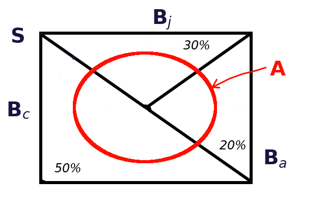

# Ejemplos

## Ejemplo 1

Por razones de pagos en publicidad, un piloto de autos usa un Corvette en el 50% de las carreras en las que participa, un Jaguar, en el 30% de esas carreras y un Alfa Romeo, en el 20% de las mismas. De 25 carreras en las que ha participado con el Corvette, ha ganado 5; de 15, en las que ha participado con el Jaguar, ha ganado 4; y de 10, en las que ha participado con el Alfa Romeo, ha ganado 4.

a. Haciendo uso de esa información para estimar las probabilidades, indique cuál es la probabilidad de que el piloto gane la reciente carrera en la que participará en Le Mans.
a. Suponiendo que llega la notificación de que, en efecto, ganó la carrera, ¿cuál es la probabilidad de que haya manejado el Corvette?

### Solución {-}

La Figura \@ref(fig:Autos1) representa esquemáticamente algunos de los elementos del problema, en esta figura:

1. $S$ representa el conjunto de todas las carreras que ha corrido el piloto.
1. $B_c$ son las carreras en las que ha usado el Corvette.
1. $B_j$ son las carreras en las que ha usado el Jaguar.
1. $B_a$ son las carreras en las que ha usado el Alfa Romeo.
1. $A$ representa el conjunto de carreras en las que ha ganado.

(\#fig:Autos1)Diagrama de Venn para el problema del piloto de autos

