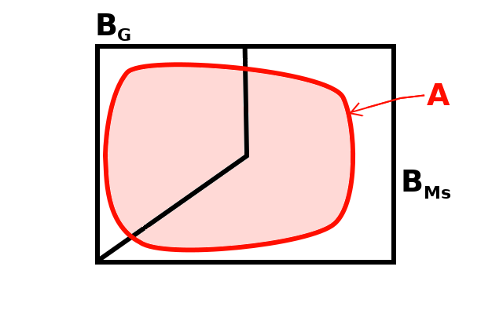
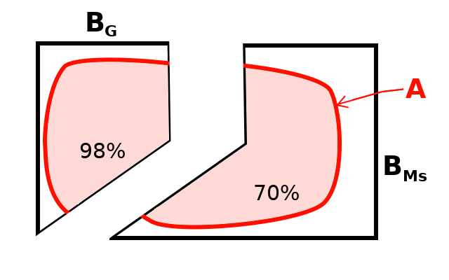
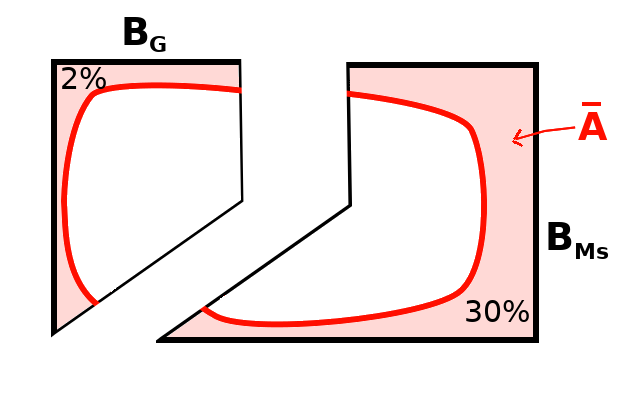

# Ejemplos

## Ejemplo 1

Una empresa utiliza filtros procedentes de dos marcas de *software* para detectar correo *spam*: la marca **Ms**
y la marca **G**. Estadísticamente se ha determinado a nivel mundial que **Ms** clasifica correctamente 
sólo el 70% de los correos como *spam* o *no-spam*, mientras que **G** alcanza el 98%. Sin embargo, 
como la junta directiva se ha dejado llevar por la marca, ha determinado que 65% de sus correos sean 
filtrados por el *software* de **Ms**, mientras que el resto, o sea, el 35%, sean asignados para ser filtrados por el *software* de la marca **G**. 

a. Roberto, el ingeniero de sistemas de la empresa, que es mucho más consciente de la realidad, quiere convencer
a la junta directiva de cambiar su política de asignación y para ello se ha propuesto responder a la
pregunta: ¿Cuál es la probabilidad de que un correo bien detectado, ya sea como *spam* o *no-spam*, proceda de **Ms**?

### Solución {-}

Primeramente se procede a identificar los distintos eventos del problema. 

1. $A=$ se ha clasificado correctamente el correo, ya sea como *spam* o como *no-spam*.
1. $B_{Ms}=$ se ha asignado al *software* de la marca **Ms** para filtrar el correo.
1. $B_{G}=$ se ha asignado al *software* de la marca **G** para filtrar el correo.

La asignación total del volumen de correos por marca de *software* se muestra en la Figura \@ref(fig:Correos1).

<div class="figure">

<p class="caption">(\#fig:Correos1)Diagrama de Venn que muestra la asignación de correos por marca de software</p>
</div>

Por otra parte, el evento *A* que consiste en haber clasificado correctamente el correo, se muestra en relación con el universo de correos en la Figura \@ref(fig:Correos2).

<div class="figure">

<p class="caption">(\#fig:Correos2)Diagrama de Venn que muestra el evento $A$: el correo ha sido clasificado correctamente</p>
</div>


Se hará una tabla (*data.frame*) para capturar toda la información del problema:

```r
datos <- data.frame(
  #               marca.Ms      marca.G
  P.B       =  c(    0.65   ,    0.35     ),  # P(B)
  P.A_B     =  c(    0.70   ,    0.98     ),  # P(A|B)
  row.names =  c("marca.Ms" , "marca.G"   )
)
print(datos)
```

```
##           P.B P.A_B
## marca.Ms 0.65  0.70
## marca.G  0.35  0.98
```

Esta información se muestra en la Tabla \@ref(tab:tabla-correos1) a continuación.


Table: (\#tab:tabla-correos1)Información distribución de correos

             P.B   P.A_B
---------  -----  ------
marca.Ms    0.65    0.70
marca.G     0.35    0.98

En la tabla anterior, la columna P.A_B, es $P\left( A | B \right)$, o sea la probabilidad de que se haya clasificado bien el correo, dado que la clasificación se hizo con el *software* correspondiente al renglón de la tabla. Esto es, en términos de *relaciones de áreas*, la porción que ocupa *A* del conjunto *B* correspondiente. Esta situación se muestra gráficamente en la Figura \@ref(fig:Correos3)

<div class="figure">

<p class="caption">(\#fig:Correos3)Diagrama de Venn que muestra la porción que ocupa $A$: de cada una de las áreas $B$</p>
</div>

A continuación se procede a aplicar el Teorema \@ref(thm:ptotal) de la probabilidad total. Esto es multiplicar las columnas "P.B" y "P.A_B" de la Tabla \@ref(tab:tabla-correos1) y sumar todos los resultados.


```r
datos$Prod <- datos$P.B * datos$P.A_B
# La suma de las columnas
sumas <- apply(datos, 2, sum)
# Se agrega el resultado como un renglón al final:
datos["SUMAS", ] <- sumas
```

El resultado de este producto se puede ver en la columna **Prod** de la Tabla \@ref(tab:tabla-correos-prod)


Table: (\#tab:tabla-correos-prod)Productos de probabilidades en el caso de correos

             P.B   P.A_B    Prod
---------  -----  ------  ------
marca.Ms    0.65    0.70   0.455
marca.G     0.35    0.98   0.343
SUMAS       1.00    1.68   0.798

De acuerdo con este resultado, la probabilidad de que, en general, un correo sea clasificado correctamente es 
del 79.8%.

Para averiguar la probabilidad de que un correo bien detectado, ya sea como *spam* o *no-spam*, proceda de **Ms**, se aplica el Teorema \@ref(thm:bayes0) de Bayes. Para ello se divide el producto en el renglón correspondiente a **Ms** entre la probabilidad recien obtenida, así:


```r
(Prob.Ms <- datos["marca.Ms","Prod"]/datos["SUMAS","Prod"])
```

```
## [1] 0.5701754
```
Esto es, dado que se clasificó correctamente el correo, la **probabilidad de que para esta operación se haya usado el _software_ de Ms** es de 57.02%.

Después de presentar estos resultados a la junta directiva de la empresa, la respuesta que Roberto recibió no fue muy amable, como se puede ver en la ilustración de la Figura \@ref(fig:Caricat1).

<div class="figure">

<p class="caption">(\#fig:Caricat1)Respuesta de los directivos de la empresa</p>
</div>

Aunque en un principio la respuesta lo tomó por sorpresa, en vez de desanimarse, Roberto trató de replantear el problema desde una prespectiva diferente, tal como se ilustra en la Figura \@ref(fig:Caricat2).

<div class="figure">

<p class="caption">(\#fig:Caricat2)El problema visto desde otra perspectiva</p>
</div>
Esto da lugar a la segunda parte de este problema, cuya descripción se hace en seguida:


b. Determinar la probabilidad que que un correo mal clasificado, ya sea como *spam* o *no-spam*, provenga del *software* provisto por **Ms**.

Con el propósito de responder a esta pregunta, debe notarse que ahora el tema ya no es el evento $A$ sino su complemento, $\bar{A}$. Para resolver el problema, solamente es necesario modificar la columna "P.A_B", de la tabla anterior, de acuerdo con los nuevos datos mostrados en la Figura \@ref(fig:Correos4) y proceder a los cálculos correspondientes.

<div class="figure">

<p class="caption">(\#fig:Correos4)Diagrama de Venn que muestra la porción que ocupa $\bar { A }$ : de cada una de las áreas $B$</p>
</div>


```r
#                 marca.Ms      marca.G  SUMA
datos$P.A_B <- c(    0.30   ,    0.02,    NA ) # P(A|B)
# Se corrigen los productos
datos$Prod <- datos$P.B * datos$P.A_B

# Se agregan las sumas corregidas como el renglón final:
datos["SUMAS", ] <- apply(datos[-3, ], 2, sum)
```
En la Tabla \@ref(tab:tabla-correos-final) se pueden apreciar los resultados de estas operaciones.


Table: (\#tab:tabla-correos-final)Productos de probabilidades en el caso de correos mal clasificados

             P.B   P.A_B    Prod
---------  -----  ------  ------
marca.Ms    0.65    0.30   0.195
marca.G     0.35    0.02   0.007
SUMAS       1.00    0.32   0.202

Finalmente, se aplica el Teorema \@ref(thm:bayes0) de Bayes. Para ello se divide el producto en el renglón correspondiente a **Ms** entre la probabilidad total, registrada el renglón "SUMAS" y columna "Prod", así:


```r
(Prob.Ms <- datos["marca.Ms","Prod"]/datos["SUMAS","Prod"])
```

```
## [1] 0.9653465
```

Esto es, dado que se clasificó incorrectamente el correo, la **probabilidad de que para esta operación se haya usado el _software_ de Ms** es de 96.53%. Con este contundente resultado, Roberto pudo convencer a la junta directiva de cambiar las proporciones de asignación de correos a las distintas marcas de *software*.

¿**Qué hubiera pasado si las estadísticas del problema fueran diferentes**? Intrigado por esta pregunta, Roberto decidió resolver el problema de una manera más general. A continuación se muestra una aplicación que permite jugar con los valores de las distintas variables del problema.

<iframe src="http://172.16.19.27:3838/users/checo/miniBayes/?showcase=0" width="672" height="700px"></iframe>

## Ejemplo 2

Por razones de pagos en publicidad, un piloto de autos usa un Corvette en el 50% de las carreras en las que participa, un Jaguar, en el 30% de esas carreras y un Alfa Romeo, en el 20% de las mismas. De 25 carreras en las que ha participado con el Corvette, ha ganado 5; de 15, en las que ha participado con el Jaguar, ha ganado 4; y de 10, en las que ha participado con el Alfa Romeo, ha ganado 4.

a. Haciendo uso de esa información para estimar las probabilidades, indique cuál es la probabilidad de que el piloto gane la reciente carrera en la que participará en Le Mans.
a. Suponiendo que llega la notificación de que, en efecto, ganó la carrera, ¿cuál es la probabilidad de que haya manejado el Corvette?

NOTA: Este ejemplo fue tomado de los ejercicios del libro de @Miller65 pp. 32-34.

### Solución {-}

La Figura \@ref(fig:Autos1) representa esquemáticamente algunos de los elementos del problema, en esta figura:

1. $S$ representa el conjunto de todas las carreras que ha corrido el piloto.
1. $B_c$ son las carreras en las que ha usado el Corvette.
1. $B_j$ son las carreras en las que ha usado el Jaguar.
1. $B_a$ son las carreras en las que ha usado el Alfa Romeo.
1. $A$ representa el conjunto de carreras en las que ha ganado.

<div class="figure">

<p class="caption">(\#fig:Autos1)Diagrama de Venn para el problema del piloto de autos</p>
</div>

Para resolver el problema se usará el lenguaje de programación R [@Santana2014]. El primer paso es la construcción de una tabla con la información


```r
datos <- data.frame(
  #                 Corvette    Jaguar    Alfa_Romeo
  P.B         =  c(    0.5   ,    0.3   ,    0.2      ), # P(B)
  P.A_B       =  c(   5/25   ,   4/15   ,   4/10      ), # P(A|B)
  row.names   =  c("Corvette", "Jaguar" , "Alfa_Romeo")
)
print(datos)
```

```
##            P.B     P.A_B
## Corvette   0.5 0.2000000
## Jaguar     0.3 0.2666667
## Alfa_Romeo 0.2 0.4000000
```

Esta misma información se puede ver en la Tabla \@ref(tab:tabla-info), donde la columna **P.B** representa la probabilidad del conjunto $B$ en el renglón correspondiente, y la columna **P.A_B** es la probabilidad de que se ganó la carrera dado que se usó el auto en el renglón correspondiente.


Table: (\#tab:tabla-info)Información del piloto de autos

              P.B       P.A_B
-----------  ----  ----------
Corvette      0.5   0.2000000
Jaguar        0.3   0.2666667
Alfa_Romeo    0.2   0.4000000

La solución del inciso **a** del problema se obtiene por medio de la aplicación del Teorema \@ref(thm:ptotal) de la probabilidad total. Esto es multiplicar las columnas "P.B" y "P.A_B" de la tabla anterior y sumar todos los resultados.


```r
datos$Prod <- datos$P.B * datos$P.A_B
```

El resultado de este producto se puede ver en la columna **Prod** de la Tabla \@ref(tab:tabla-c-prod)


Table: (\#tab:tabla-c-prod)Productos de probabilidades

              P.B       P.A_B   Prod
-----------  ----  ----------  -----
Corvette      0.5   0.2000000   0.10
Jaguar        0.3   0.2666667   0.08
Alfa_Romeo    0.2   0.4000000   0.08

Ahora se procede a hacer la suma de los valores en la columna **Prod** de la Tabla \@ref(tab:tabla-c-prod) con


```r
(Prob.A <- sum(datos$Prod))
```

```
## [1] 0.26
```

Asi entonces, la **probabilidad de que el piloto gane su carrera** es del 26%.

Para resolver el inciso **b** del problema se aplica el Teorema \@ref(thm:bayes0) de Bayes. En este caso es simplemente dividir el producto en el renglón correspondiente al auto "Corvette" entre la probabilidad recien obtenida, así:


```r
(Prob.Corvette <- datos["Corvette","Prod"]/Prob.A)
```

```
## [1] 0.3846154
```
Esto es, dado que el piloto en efecto ganó la carrera, la **probabilidad de que haya usado el Corvette** es de 38.46%.


